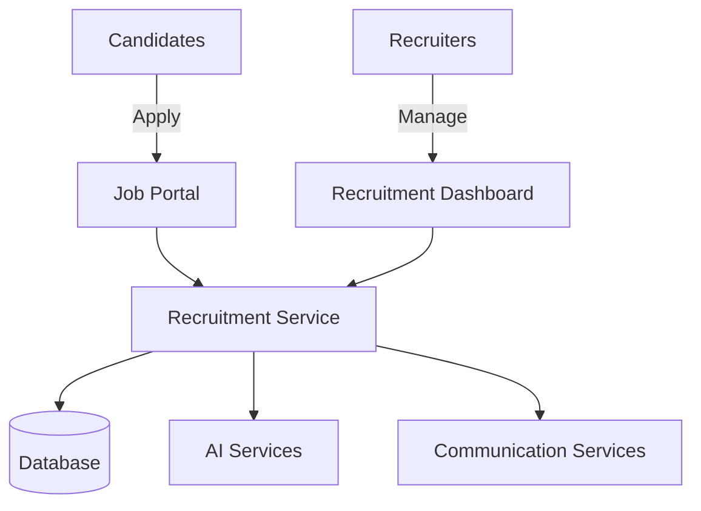

# Cognitive Hire


> *AI-powered recruitment platform that transforms how organizations find, screen, and hire top talent.*

[](LICENSE)
[]()
[]()

## 🚀 Overview

**Cognitive Hire** is a next-generation recruitment platform that leverages AI agents to automate complex hiring workflows while maintaining the human touch that candidates deserve. Our platform combines cutting-edge AI with robust recruitment practices to reduce time-to-hire by 60% and increase quality-of-hire by 40%.


## ✨ Key Features

- **AI-Powered Recruitment Agents** - Autonomous AI agents handle job creation, candidate sourcing, screening, and coordination
- **Multi-Channel Candidate Sourcing** - Discover candidates across LinkedIn, job boards, your ATS, and open web
- **Smart Screening & Matching** - Hybrid semantic + keyword matching for precise skill evaluation
- **Interactive Interest Checks** - Engage candidates via email, SMS, and phone using conversational AI
- **Seamless Publishing** - Distribute job listings across multiple platforms with one click
- **Intelligent Scheduling** - Automated interview coordination that respects everyone's calendar
- **Real-Time Analytics** - Data-driven insights into your recruiting pipeline performance

## 🧠 AI Agent Architecture

Our unique approach uses autonomous AI agents to perform tasks that typically require human judgment:

- **Job Definition Agent** - Creates and optimizes job descriptions from minimal input
- **Sourcing Agent** - Discovers and evaluates potential candidates across the web
- **Screening Agent** - Assesses candidate skills and experience with semantic understanding
- **Coordination Agent** - Handles scheduling, follow-ups, and candidate communication

Each agent uses a combination of LLMs, specialized tools, and human feedback mechanisms to deliver exceptional results.

## 🏛️ Architecture

Cognitive Hire is built on a modern, scalable architecture:



- **Frontend**: Next.js-based responsive applications with server components
- **Backend**: Domain-driven microservices built with FastAPI
- **AI Layer**: Azure OpenAI Service with custom fine-tuning
- **Data Storage**: PostgreSQL for structured data, Cosmos DB for document storage
- **Infrastructure**: Azure Cloud with Infrastructure-as-Code deployment

See our [architecture documentation](./architecture/) for detailed design information.

## 🚀 Getting Started

### Prerequisites

- Docker and Docker Compose
- Node.js 18+ and npm/yarn
- Python 3.11+
- Azure account (for full deployment)

### Local Development Setup

1. Clone the repository
   ```bash
   git clone https://github.com/yourusername/cognitive-hire.git
   cd cognitive-hire
   ```

2. Start the services using Docker Compose
   ```bash
   docker-compose up -d
   ```

3. Set up the frontend application
   ```bash
   cd frontend
   npm install
   npm run dev
   ```

4. Visit http://localhost:3000 to access the application

For detailed setup instructions, see our [Development Guide](./docs/development-guide.md).

## 📊 Demo

See Cognitive Hire in action:

- [Live Demo]()
- [Video Walkthrough]()
- [Interactive Features Tour]()

## 📚 Documentation

- [User Guide](./docs/user-guide.md)
- [API Reference](./docs/api-reference.md)
- [Architecture](./architecture/high-level-design.md)
- [Development Guide](./docs/development-guide.md)
- [Deployment Guide](./docs/deployment.md)

## 🤝 Contributing

Still thinking ...

## 📄 License

This project is licensed under the MIT License - see the [LICENSE](LICENSE) file for details.

## 🙏 Acknowledgments

- [Microsoft Azure OpenAI Service](https://azure.microsoft.com/en-us/services/cognitive-services/openai-service/) for AI capabilities
- [FastAPI](https://fastapi.tiangolo.com/) for high-performance backend services
- [Next.js](https://nextjs.org/) for our reactive frontend applications
- All our open source dependencies and contributors

## 📬 Contact

- Website: [Coming soon ...]()
- Email: [Coming soon ...]()

---

<p align="center">Artha Nirman Pty Ltd. All rights reserved.</p>
