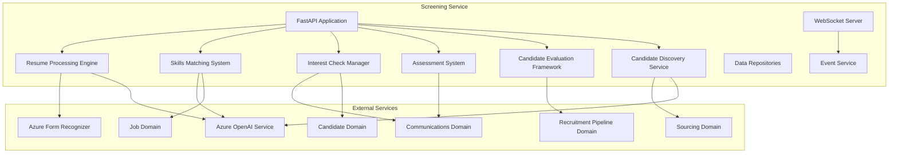

# Component Design

## Component Architecture Overview

The Screening Service is implemented as a FastAPI-based microservice with dual protocol support (REST and WebSockets). The service is composed of several key components that work together to implement the screening and shortlisting capabilities.

## Component Responsibilities

### 1. FastAPI Application (REST Interface)

**Responsibilities**:
- Handle API requests for resume management, skills matching, interest checks, and assessments
- Validate incoming requests using Pydantic models
- Delegate business logic to appropriate components
- Return standardized responses
- Implement authentication and authorization

### 2. WebSocket Server

**Responsibilities**:
- Maintain WebSocket connections for real-time updates
- Authenticate WebSocket clients
- Publish real-time updates during long-running operations
- Handle connection management

### 3. Resume Processing Engine (Deep Screening)

**Responsibilities**:
- Orchestrate the resume parsing workflow using tiered approach
- Manage document storage in blob storage
- Select appropriate parsing strategy based on document characteristics
- Extract structured data from resumes
- Generate normalized skills, experience, and education data

**Tiered Parsing Approach**:
1. Text-based Parser (Tier 1): For well-structured documents (~80% of cases)
2. Form Recognizer (Tier 2): For documents with complex formatting  
3. Vision AI (Tier 3): Last resort for problematic documents

### 4. Candidate Discovery Service (Light Screening)

**Responsibilities**:
- Coordinate with Sourcing Domain for online candidate discovery
- Generate optimized search queries for candidate discovery
- Process and structure scraped professional data
- Generate preliminary candidate profiles
- Perform lightweight skills matching based on discovered data

### 5. Skills Matching System

**Responsibilities**:
- Implement different matching algorithms (keyword, semantic, hybrid)
- Retrieve job requirements from Job Domain
- Calculate match scores for both light and deep screening
- Generate match explanations
- Store match results

**Matching Approaches**:
- Keyword Matching: Direct comparison with synonym expansion
- Semantic Matching: Using embeddings from Azure OpenAI
- Hybrid Matching: Combining both approaches with weighted scoring

### 6. Interest Check Manager

**Responsibilities**:
- Create and send interest check messages
- Track response status across multiple channels
- Process candidate responses
- Coordinate with Communications Domain for message delivery

**Supported Channels**:
- Email: For formal communication
- SMS: For urgent outreach
- Call: For phone assessments using AI agents
- LinkedIn: For professional network outreach

### 7. Assessment System

**Responsibilities**:
- Manage phone assessments conducted by AI agents
- Handle scheduling and retries for callbacks
- Process assessment results using conversation analysis
- Track assessment status and outcomes

**Assessment Process**:
- Initial scheduling
- Automated calling with AI agent
- Conversation analysis
- Results evaluation
- Callback scheduling if needed

### 8. Candidate Evaluation Framework

**Responsibilities**:
- Determine appropriate screening approach (light vs deep)
- Coordinate overall screening workflow
- Calculate candidate qualification scores
- Generate recommendations
- Update recruitment pipeline status

**Evaluation Factors**:
- Resume match score
- Skills match score
- Interest check results
- Assessment performance
- Organization requirements

### 9. Data Repositories

**Responsibilities**:
- Abstract database access for domain entities
- Implement data access patterns
- Ensure multi-tenancy isolation
- Maintain data integrity

### 10. Event Service

**Responsibilities**:
- Publish domain events to centralized event bus
- Subscribe to events from other domains
- Coordinate with WebSocket server for real-time updates
- Store event history for auditing

## Integration with External Systems

### Communication with Job Domain
- Retrieve job requirements and skills for matching
- Get job details for messaging and assessment

### Communication with Communications Domain
- Send emails, SMS, and other messages
- Schedule and conduct AI phone calls
- Receive delivery confirmations and responses

### Communication with Sourcing Domain
- Request candidate discovery through external channels
- Receive discovered candidate profiles

### Communication with Recruitment Pipeline Domain
- Update candidate status in recruitment workflow
- Receive candidate stage change notifications

## Error Handling and Resilience

- Circuit breakers for external service calls
- Retry policies with exponential backoff
- Dead letter handling for failed events
- Comprehensive logging and instrumentation
