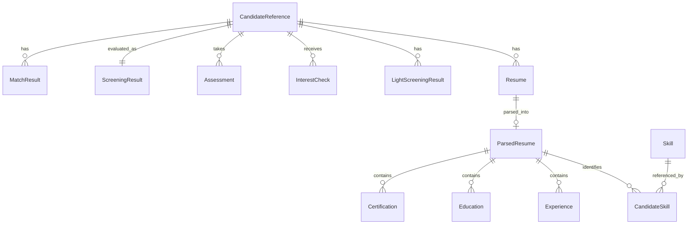

# Data Model

## Core Entities and Relationships

## Key Entity Descriptions

### Candidate Reference
Tracks a candidate in the screening process for a specific job.
- **Attributes**: id, tenant_id, candidate_id, job_id, screening_type (LIGHT/DEEP), resume_source, created_at, updated_at
- **Relationships**: Has many Resumes, InterestChecks, Assessments, MatchResults

### Resume (Deep Screening)
Stores information about an uploaded resume.
- **Attributes**: id, file_name, file_format, file_path, parsing_status, parsing_method, created_at
- **Relationships**: Belongs to CandidateReference, Has one ParsedResume

### LightScreeningResult (Light Screening)
Stores data from candidate discovery and online profile scraping.
- **Attributes**: id, source_url, scraped_data, confidence_score, created_at
- **Relationships**: Belongs to CandidateReference

### Parsed Resume
Contains structured data extracted from a resume.
- **Attributes**: id, resume_id, raw_text, contact_info, structured_data, confidence_score, parsed_at
- **Relationships**: Belongs to Resume, Has many Skills, Experiences, Educations

### Skill & Candidate Skill
Represents skills in a normalized taxonomy and candidate's specific skills.
- **Skill Attributes**: id, name, category, aliases
- **CandidateSkill Attributes**: experience_years, level, confidence_score, is_verified, context_snippets
- **Relationships**: Many-to-many between Candidates and Skills

### Interest Check
Tracks outreach to candidates about their interest in positions.
- **Attributes**: id, channel, status, sent_at, responded_at, response_content, response_type
- **Relationships**: Belongs to CandidateReference

### Assessment
Manages phone assessments conducted by AI agents.
- **Attributes**: id, assessment_type, status, scheduled_at, completed_at, score, pass_threshold
- **Relationships**: Belongs to CandidateReference

### Screening Result
Stores the overall evaluation result.
- **Attributes**: id, status, screening_type, resume_score, skills_match_score, interest_level, assessment_score, overall_score
- **Relationships**: Belongs to CandidateReference

## Database Implementation

The data model is implemented using two storage approaches:

1. **PostgreSQL**: For transactional data and structured entities
   - All core domain entities
   - Relational data with referential integrity
   - Normalized data model

2. **Cosmos DB**: For event-driven data and analytics
   - Event history
   - Performance analytics 
   - Workflow state tracking

## GDPR Compliance Implementation

Our data model implements:

1. **Data Minimization**: Only storing necessary data for screening
2. **Purge Capability**: Methods to completely remove candidate data
3. **Data Export**: Methods to export all candidate data in portable format
4. **Consent Tracking**: Each screening activity tracks appropriate consent
5. **Purpose Limitation**: Data is tied to specific job applications
