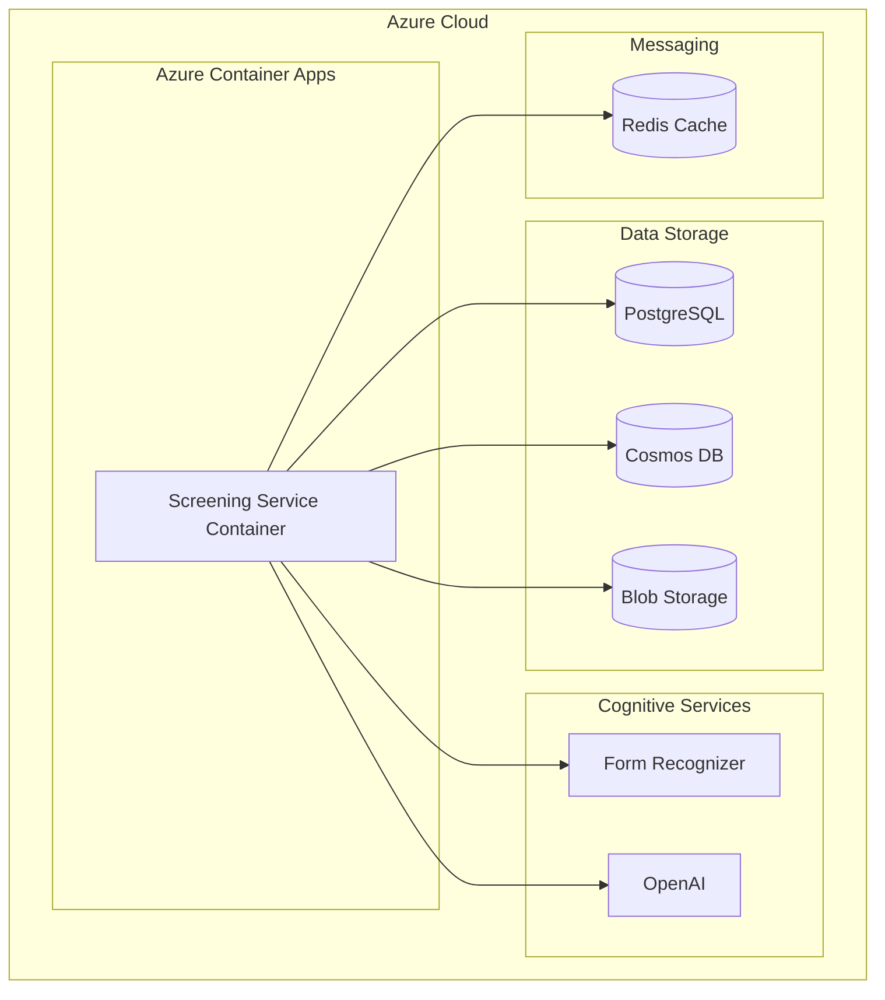

# Deployment Configuration

## Deployment Architecture

## Key Infrastructure Components

1. **Azure Container Apps**
   - Hosts the Screening Service container
   - Managed Kubernetes environment
   - Automatic scaling based on load
   - Built-in service discovery

2. **PostgreSQL Database**
   - Stores structured data model
   - Flexible Server deployment for cost efficiency
   - Point-in-time recovery enabled

3. **Blob Storage**
   - Stores raw resume files
   - Tiered access for cost optimization
   - Lifecycle management (auto-archiving)

4. **Azure Cognitive Services**
   - Form Recognizer for document parsing
   - OpenAI for semantic matching and analysis

5. **Redis Cache**
   - Real-time communication for WebSockets
   - Caching for performance optimization

6. **Cosmos DB**
   - Event storage and analytics
   - Multi-region deployment in production

## Environment Configuration

The service is configured differently across environments:

| Configuration | Development | Test | Production |
|---------------|------------|------|------------|
| Container Resources | 0.5 CPU, 1GB RAM | 0.5 CPU, 1GB RAM | 1.0 CPU, 2GB RAM |
| Replicas | min: 1, max: 3 | min: 1, max: 3 | min: 2, max: 10 |
| Storage Account | LRS replication | LRS replication | GRS replication |
| Form Recognizer | Free tier (F0) | Free tier (F0) | Standard tier (S0) |
| Redis Cache | Basic tier | Basic tier | Standard tier |

## CI/CD Pipeline

The service is deployed using a GitHub Actions workflow that:
1. Runs tests and validation on PRs
2. Builds and pushes Docker image to Azure Container Registry
3. Updates container in Azure Container Apps
4. Applies infrastructure changes using Terraform

## Scaling Configuration

The service scales based on:
- CPU utilization (>70%)
- Memory usage (>80%)
- Request rate (>100 req/sec)
- Active WebSockets (>500/instance)

## Monitoring and Observability

1. **Application Insights** for performance monitoring
2. **Log Analytics** for centralized logging
3. **Custom Metrics** for business KPIs
4. **Dashboards** for operational visibility
