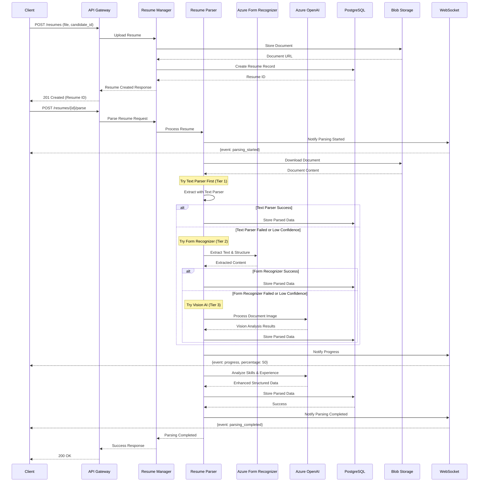
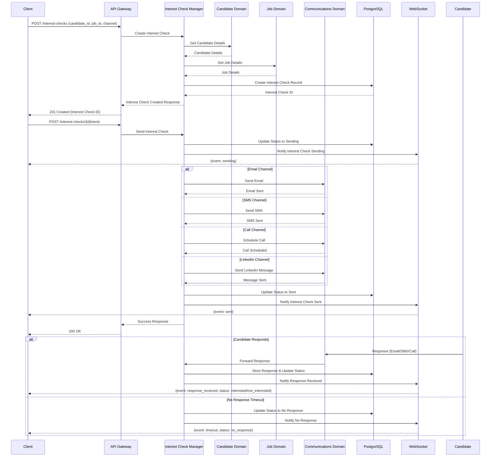
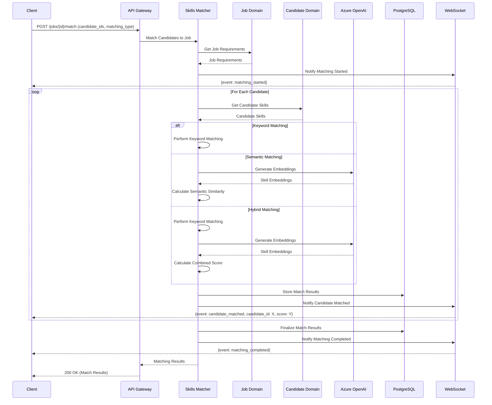
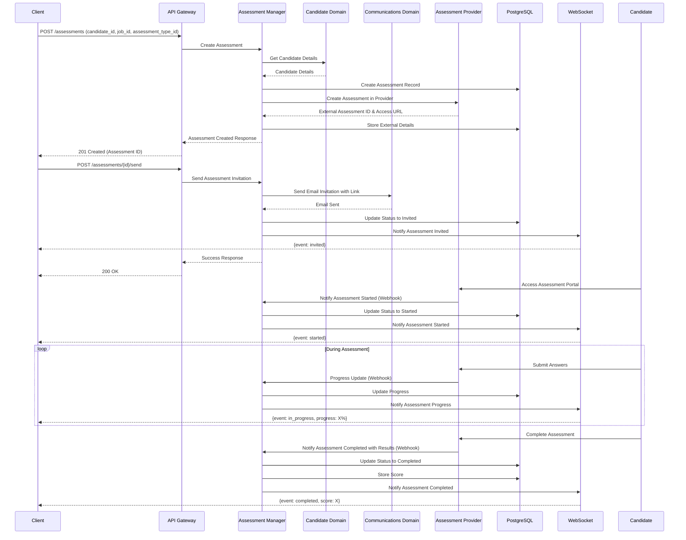
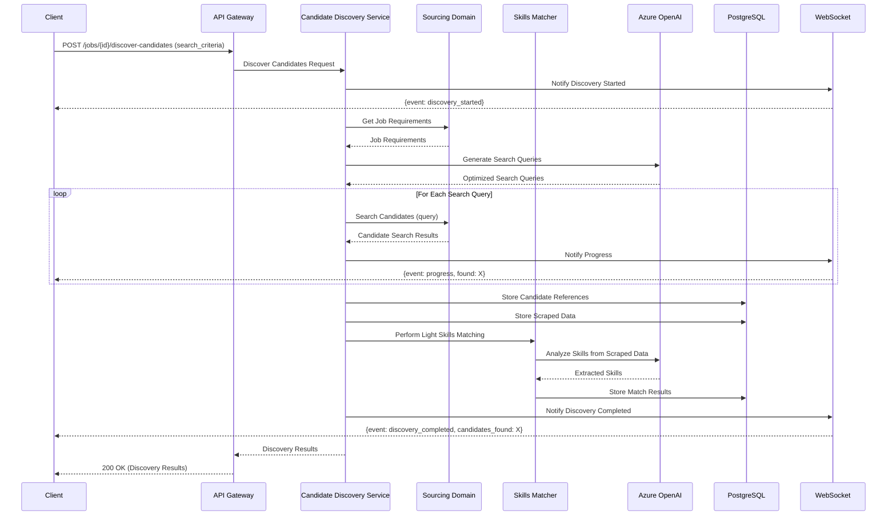
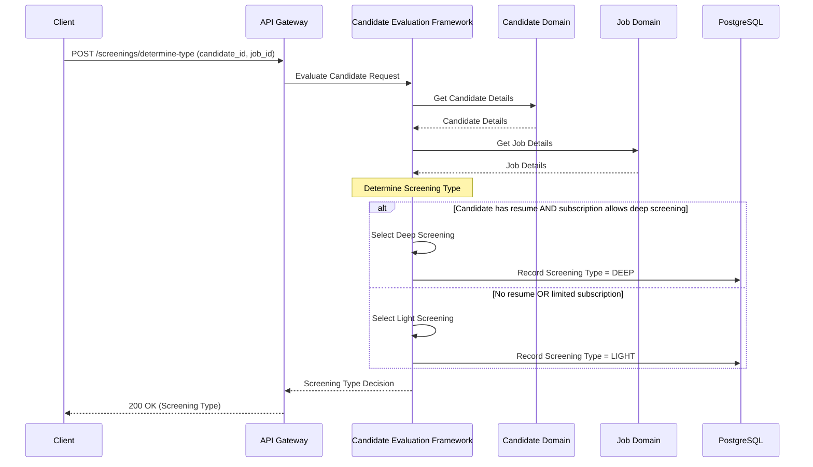

# Key Workflows

This document outlines the primary workflows implemented by the Screening Service.

## Resume Upload and Parsing Flow

## Interest Check Workflow

## Skills Matching Flow

## Assessment Flow

## Light Screening Workflow

## Screening Type Decision Flow

