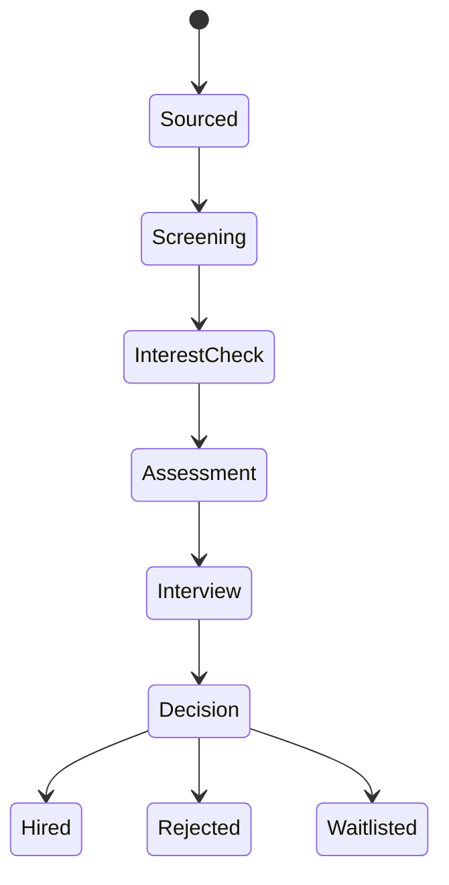
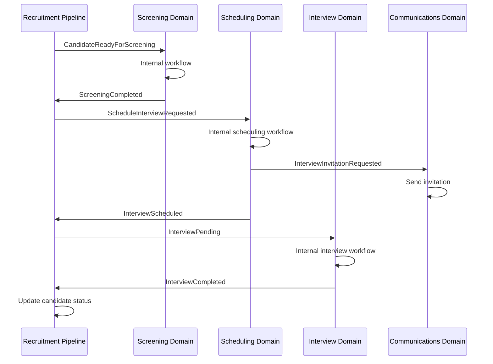

# Cross-Domain Workflow Management

## Traceability Links
- **Concept Elements**: [Workflow](../../concept-paper.md#35-recruitment-workflow-components), [Screening](../../concept-paper.md#35-recruitment-workflow-components), [Shortlisting](../../concept-paper.md#35-recruitment-workflow-components)
- **HLD Components**: [Recruitment Pipeline Domain (§8)](../../high-level-design.md#8-recruitment-pipeline-domain), [Event-Driven Architecture (§16)](../../high-level-design.md#16-technical-implementation)
- **Related DDRs**: [DDR-001](../../high-level-design.md#ddr-001-domain-based-microservice-architecture)

## Justification for Separate Document
This document addresses a cross-cutting architectural concern that spans multiple domains and directly implements the "Pipeline tracking" capability described in the concept paper's Workflow section. While it could be incorporated as a DDR, it serves better as a reference document for all domain-specific LLDs to ensure consistent implementation of cross-domain workflows.

## Overview

While each domain manages its internal workflows, recruitment processes inherently span multiple domains (e.g., a candidate moving from sourcing → screening → interview → hiring). This document defines our approach to managing these cross-cutting concerns.

## Orchestration Strategy: Hybrid Approach

We will implement a hybrid orchestration model that balances domain autonomy with process visibility:

### 1. Recruitment Pipeline as State Coordinator

The Recruitment Pipeline Domain will:
- Maintain a high-level state machine for each candidate-job combination
- Track progression through major recruitment stages
- Store metadata about each stage (timestamps, assigned users, decisions)
- Provide a unified view of the recruitment process
- Generate events for stage transitions

### 2. Domain Autonomy with Event Communication

Each domain:
- Manages its own internal workflows independently
- Publishes domain events when significant state changes occur
- Subscribes to relevant events from other domains
- Makes autonomous decisions within its boundaries

## Cross-Domain Event Flow Example

## Domain Responsibility Matrix

| Process Stage | Primary Domain | Supporting Domains | Coordination Mechanism |
|---------------|----------------|---------------------|-------------------------|
| Job Creation | Job | - | Self-contained |
| Candidate Sourcing | Sourcing | Job | Event-based |
| Resume Screening | Screening | - | Self-contained |
| Interest Check | Screening | Communications | Event-based |
| Assessment | Screening | Communications | Event-based |
| Interview Scheduling | Scheduling | Calendar, Communications | Pipeline orchestrated |
| Interview Feedback | Interview | - | Self-contained |
| Offer Management | Hiring | Communications, Financial | Pipeline orchestrated |

## Implementation Guidelines

1. **Event Standards**:
   - All events must include candidate ID, job ID, and timestamp
   - Events should be versioned
   - Events should be idempotent when possible

2. **State Management**:
   - Primary source of truth for a candidate's stage is in Pipeline Domain
   - Domains should validate state transitions against Pipeline before proceeding
   - Reconciliation process for handling inconsistencies

3. **Error Handling**:
   - Compensating transactions for failed cross-domain processes
   - Clear responsibility for error resolution
   - Event replay capability for recovery

## Traceability Requirements for Domain LLDs

Each domain-specific LLD that participates in cross-domain workflows must:

1. **Document Event Production**:
   - List all events the domain publishes
   - Define event schema with required fields
   - Specify conditions that trigger each event

2. **Document Event Consumption**:
   - List all events the domain subscribes to
   - Define actions taken in response to each event
   - Specify error handling for missing or malformed events

3. **State Machine Integration**:
   - Document integration with the Recruitment Pipeline state machine
   - Define valid state transitions the domain can initiate
   - Specify validation rules for state transitions

## Traceability Requirements for Service Documentation

Each service documentation that participates in cross-domain workflows must:

1. **Document Event Production**:
   - List all events the domain publishes
   - Define event schema with required fields
   - Specify conditions that trigger each event

2. **Document Event Consumption**:
   - List all events the domain subscribes to
   - Define actions taken in response to each event
   - Specify error handling for missing or malformed events

3. **State Machine Integration**:
   - Document integration with the Recruitment Pipeline state machine
   - Define valid state transitions the domain can initiate
   - Specify validation rules for state transitions

## Deployment Considerations 

To balance decoupling benefits with operational complexity, we recommend:

### Initial Phase: Pragmatic Service Grouping

Start with logical service groupings to reduce operational complexity:

| Deployment Unit | Contained Domains | Rationale |
|-----------------|-------------------|-----------|
| Candidate Service | Candidate, Sourcing, Screening | These domains deal with candidate acquisition and evaluation |
| Job Service | Job, Publishing | These domains focus on job definition and distribution |
| Workflow Service | Recruitment Pipeline, Interview | These domains manage the candidate journey |
| Scheduling Service | Scheduling | Scheduling has unique technical requirements (calendar integration) |
| Communications Service | Communications | Centralized notification handling |
| Support Services | Analytics, Financial, Compliance, Audit | Administrative functions |

### Later Phase: Domain Separation

As the system matures and the team grows, separate high-traffic or complex domains:

1. Extract Screening from Candidate Service
2. Extract Interview from Workflow Service
3. Further decompose based on scale and team organization

### Deployment Decision Factors

When deciding whether to split domains:

- **Traffic patterns**: Does the domain have significantly different scaling needs?
- **Data access patterns**: Is there minimal data sharing between domains?
- **Team organization**: Are different teams responsible for different domains?
- **Technology requirements**: Does the domain need special infrastructure?
- **Release cadence**: Does the domain change much more/less frequently than others?

This approach gives us the architectural clarity of microservices while maintaining operational practicality.
